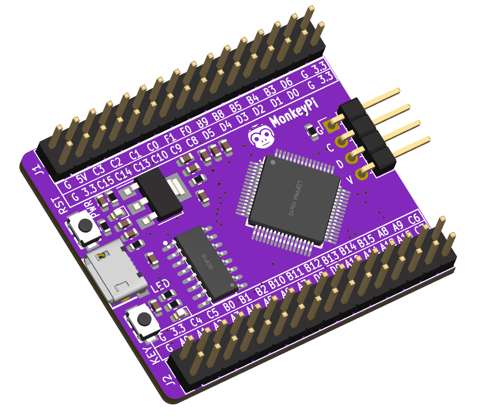
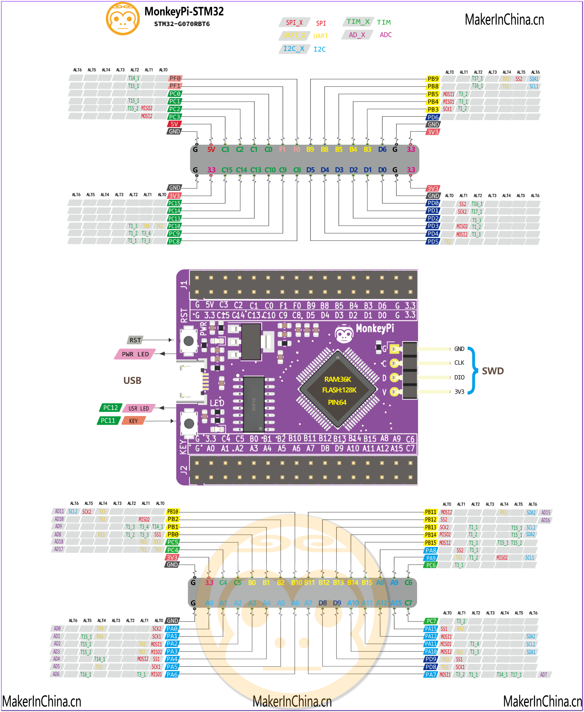

#### Examples on board MonkeyPi-STM32G070 with libopencm3 library and PlatformIO.
----

Notes: [https://makerinchina.cn/categories/STM32/](https://makerinchina.cn/categories/STM32/)

- board

- pinmap

- project template

[template_arduino](https://github.com/makerinchina-iot/MonkeyPi-STM32G070-PIO_Libopencm3_example/tree/main/template_arduino): this is the arduino stm32 template on platformio;

[template_libopencm3](https://github.com/makerinchina-iot/MonkeyPi-STM32G070-PIO_Libopencm3_example/tree/main/template_libopencm3): this is the libopencm3 template on platformio;
